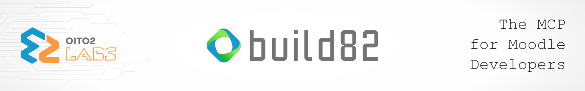

# build82

<p align="center">
  
</p>

[](https://github.com/oito2/mcp-build82/actions/workflows/ci.yml)
[](https://pkg.go.dev/github.com/oito2/mcp-build82)
[](../../go.mod)
[](https://github.com/oito2/mcp-build82/releases)
[](../../LICENSE)
[](#uso-de-ia-no-projeto)

🌐 **Idioma:** [English](../../README.md) · Português

Um servidor MCP (Model Context Protocol) que dá a assistentes de IA compreensão estrutural de uma
instalação Moodle e seus plugins, para que eles respondam perguntas sobre o código e construam
plugins seguindo as convenções reais dele. Distribuído como um único binário estático.

## Índice

- [Visão geral](#visão-geral)
- [Pré-requisitos e instalação rápida](#pré-requisitos-e-instalação-rápida)
- [Configuração dos clientes](#configuração-dos-clientes)
- [Atualização e manutenção](#atualização-e-manutenção)
- [Documentação](#documentação)
- [Uso de IA no Projeto](#uso-de-ia-no-projeto)
- [Licença](#licença)

## Visão geral

Aponte o build82 para uma instalação Moodle e ele varre o código (version.php, `db/*.php`, schemas
XMLDB, PHPDoc, hooks, tasks, capabilities, web services...) e gera um conjunto de arquivos
Markdown descrevendo a instalação e qualquer plugin que você esteja desenvolvendo. Um assistente
de IA conectado a ele pode então responder perguntas sobre o código, gerar novos plugins seguindo
as convenções existentes e manter os docs sincronizados enquanto você trabalha.

**Principais funcionalidades:**

- **13 índices globais** da instalação — índice de API, tabelas do BD, eventos, tasks,
  capabilities, classes, web services, o índice de plugins e mais.
- **12 arquivos de contexto por plugin** — arquitetura, dependências, fluxo de execução,
  configurações e um resumo pronto para IA.
- **13 tools MCP, 3 prompts MCP e resources MCP** — gerar contexto, buscar na API e nos plugins,
  explicar um plugin, diagnosticar o ambiente (`doctor`), empacotar um plugin para release e criar
  o esqueleto de um novo plugin.
- **File watcher** que regenera o contexto de um plugin em desenvolvimento sempre que o código
  dele muda.
- **Dois backends de extração PHP** — regex rápido (padrão) ou tree-sitter em Go puro.
- **Saída organizada** — tudo é escrito sob `.build82/` (na raiz do Moodle e na raiz de cada
  plugin), nunca solto na raiz do Moodle ou do plugin.
- **Registro nativo** em 8 clientes MCP e **auto-atualização** verificada por checksum, com
  rollback.

## Pré-requisitos e instalação rápida

**Pré-requisitos:**

- Uma instalação Moodle local (o build82 lê a árvore de código dela).
- Um cliente MCP — veja [Configuração dos clientes](#configuração-dos-clientes).
- Opcional: [`universal-ctags`](https://github.com/universal-ctags/ctags) no `PATH`, para gerar
  também um arquivo `.build82/tags` para navegação no editor.
- Só para compilar a partir do código-fonte: Go 1.26+.

**Baixe um binário de release** (sem precisar de toolchain Go). Toda release inclui um
`checksums.txt` — verifique antes de confiar num binário baixado. Guia completo, passo a passo,
com verificação de checksum e solução de problemas: [Guia de Instalação](getting-started/installation.md).

<details>
<summary><strong>🐧 Linux</strong></summary>

```bash
# amd64
curl -LO https://github.com/oito2/mcp-build82/releases/latest/download/build82_linux_amd64
curl -LO https://github.com/oito2/mcp-build82/releases/latest/download/checksums.txt
sha256sum -c checksums.txt --ignore-missing \
  && chmod +x build82_linux_amd64 \
  && sudo mv build82_linux_amd64 /usr/local/bin/build82

# arm64
curl -LO https://github.com/oito2/mcp-build82/releases/latest/download/build82_linux_arm64
curl -LO https://github.com/oito2/mcp-build82/releases/latest/download/checksums.txt
sha256sum -c checksums.txt --ignore-missing \
  && chmod +x build82_linux_arm64 \
  && sudo mv build82_linux_arm64 /usr/local/bin/build82

build82 --version
```

</details>

<details>
<summary><strong>🍎 macOS</strong></summary>

Verifique seu chip com `uname -m` (`arm64` = Apple Silicon, `x86_64` = Intel):

```bash
# Apple Silicon (M1/M2/M3/M4)
curl -LO https://github.com/oito2/mcp-build82/releases/latest/download/build82_darwin_arm64
curl -LO https://github.com/oito2/mcp-build82/releases/latest/download/checksums.txt
shasum -a 256 -c checksums.txt --ignore-missing \
  && chmod +x build82_darwin_arm64 \
  && sudo mv build82_darwin_arm64 /usr/local/bin/build82

# Intel
curl -LO https://github.com/oito2/mcp-build82/releases/latest/download/build82_darwin_amd64
curl -LO https://github.com/oito2/mcp-build82/releases/latest/download/checksums.txt
shasum -a 256 -c checksums.txt --ignore-missing \
  && chmod +x build82_darwin_amd64 \
  && sudo mv build82_darwin_amd64 /usr/local/bin/build82
```

O binário não é notarizado pela Apple, então o Gatekeeper vai recusar rodá-lo na primeira vez —
remova o atributo de quarentena: `xattr -d com.apple.quarantine /usr/local/bin/build82`.

</details>

<details>
<summary><strong>🪟 Windows</strong></summary>

```powershell
Invoke-WebRequest -Uri "https://github.com/oito2/mcp-build82/releases/latest/download/build82_windows_amd64.exe" -OutFile "build82_windows_amd64.exe"
Invoke-WebRequest -Uri "https://github.com/oito2/mcp-build82/releases/latest/download/checksums.txt" -OutFile "checksums.txt"
Get-FileHash .\build82_windows_amd64.exe -Algorithm SHA256
```

Compare o `Hash` impresso com a linha de `build82_windows_amd64.exe` no `checksums.txt`; continue
somente se forem iguais:

```powershell
Unblock-File .\build82_windows_amd64.exe
New-Item -ItemType Directory -Force -Path "$env:LOCALAPPDATA\build82"
Move-Item -Force .\build82_windows_amd64.exe "$env:LOCALAPPDATA\build82\build82.exe"
[Environment]::SetEnvironmentVariable("Path", "$env:Path;$env:LOCALAPPDATA\build82", "User")
```

Reinicie o terminal e rode `build82 --version` para confirmar que está no `PATH`.
O binário não é assinado digitalmente; o `Unblock-File` acima evita que o SmartScreen bloqueie a
primeira execução ("O Windows protegeu o computador") — se o aviso ainda aparecer, clique em
**Mais informações → Executar assim mesmo**.

</details>

**Ou compile a partir do código-fonte** (exige Go 1.26+):

```bash
go install github.com/oito2/mcp-build82/cmd/build82@latest
```

## Configuração dos clientes

Registre o build82 como servidor MCP na sua ferramenta de IA:

```bash
build82 install [alvo]
```

Ele detecta quais ferramentas suportadas estão instaladas e pede o caminho do Moodle. Rode sem
alvo para configurar todas as ferramentas encontradas, ou passe um explicitamente: `claude`
(Claude Code), `claude-desktop`, `antigravity`, `codex`, `opencode`, `cursor`, `zed`,
`cline`.

Por exemplo, no Claude Code você também pode registrá-lo manualmente:

```bash
claude mcp add --scope user build82 -e BUILD82_MOODLE_PATH=/path/to/moodle -- /usr/local/bin/build82
```

O **Claude Desktop** também pode instalar o build82 como extensão desktop: toda release traz um
bundle `build82.mcpb` com os binários incluídos — veja
[Claude Desktop](guides/clients/claude-desktop.md#extensão-desktop-mcpb). O build82 também está
listado no MCP Registry oficial como `io.github.oito2/mcp-build82`.

Guias por cliente, incluindo a configuração manual: [Clientes MCP](guides/clients/).
Para remover: `build82 uninstall [alvo]` — veja [Desinstalação](getting-started/uninstallation.md).

## Atualização e manutenção

```bash
build82 self-update --check    # reporta se existe uma release mais nova, sem instalar
build82 self-update            # baixa, verifica e instala a última release
build82 self-update --rollback # restaura o binário anterior caso a nova versão se revele quebrada
```

Os downloads são verificados por checksum contra o `checksums.txt` da release e testados antes de
o binário em execução ser substituído; o binário anterior é mantido como `<caminho>.bak`, que o
`--rollback` restaura com um rename atômico. Se não houver backup, ele falha com um erro claro e
nada é alterado.

## Documentação

O site de documentação completo está em [`index.md`](index.md) (também em
[inglês](../en/index.md)). Principais pontos de entrada:

- [Início rápido](getting-started/quickstart.md) — primeira execução em poucos minutos
- [Arquitetura](concepts/architecture.md) — como o build82 funciona, fluxo de dados e decisões de design
- Referência de [Tools](reference/tools.md), [Resources](reference/resources.md) e
  [Prompts](reference/prompts.md) — cada capacidade MCP em detalhe
- Referência de [CLI](reference/cli.md) e de [Configuração](reference/configuration.md) — cada
  flag, variável de ambiente e chave de configuração
- [Prompts de exemplo](prompts.md) — o que pedir ao seu agente de IA
- [Guias](guides/workflows/examples.md) e [Solução de problemas](troubleshooting/common-issues.md)

Contribuindo: veja [`contribuindo.md`](contribuindo.md) para o fluxo de desenvolvimento e o
processo de release, e o [Código de Conduta](codigo-de-conduta.md).

## Uso de IA no Projeto

Este projeto contou com o auxílio de ferramentas de IA generativa:

- **Escopo:** Geração de boilerplate, testes unitários e refatoração de funções auxiliares.

- **Supervisão:** Todo o código gerado foi revisado, testado e validado manualmente antes da integração.

## Licença

GPL-3.0 — veja [LICENSE](../../LICENSE).
